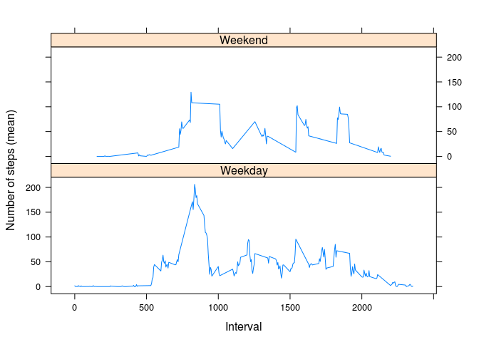

# Reproducible Research: Peer Assessment 1

This assignment makes use of data from a personal activity monitoring device. This device collects data at 5 minute intervals through out the day. The data consists of two months of data from an anonymous individual collected during the months of October and November, 2012 and include the number of steps taken in 5 minute intervals each day.


## Loading and preprocessing the data
Directory of the project:

```r
setwd("/media/marcov/A046991C4698F3EE/Data Science Specialization/Reproducible Research/RepData_PeerAssessment1")
```

Reading data and procesing date variable to Date format:


```r
data<-read.csv(unz("activity.zip", "activity.csv"))
data$date<-as.Date(data$date, format="%Y-%m-%d")
```


## What is mean total number of steps taken per day?

The total number of steps taken per day are calculated as:


```r
table1<-with(data[!is.na(data$steps),],aggregate(data$steps, by=list(data$date), FUN=sum))
colnames(table1)<-c("date","steps")
#excluding NA values in aggregate table1
table1<-table1[!is.na(table1$steps),]
```

Which gives the histogram:


```r
hist(table1$steps, 20, main="Total number of steps taken per day", xlab="Total number of steps taken per day", col="gray")
```

 

And the mean and median number of total steps are:


```r
mean(table1$steps)
```

```
## [1] 10766.19
```

```r
median(table1$steps)
```

```
## [1] 10765
```

## What is the average daily activity pattern?

The average number of steps taken by 5-minute intervals, (averaged across all days) is calculated as:


```r
table2<-aggregate(data$steps, by=list(data$interval), FUN=mean, na.rm=T)
colnames(table2)<-c("interval","mean_steps")
```

And a time series plot is shown with:


```r
plot(table2$interval, table2$mean_steps, type="l", main="Average number of steps taken by time (5-min interval)",
     xlab="5-minute interval", ylab="Mean steps taken")
```

 

Where the maximum value is given in the interval:


```r
table2$interval[which(table2$mean_steps==max(table2$mean_steps))]
```

```
## [1] 835
```

## Imputing missing values

The total number of missing values by variable is given by:


```r
apply(data, 2,function(x){sum(is.na(x))})
```

```
##    steps     date interval 
##     2304        0        0
```

To construct a data set with imputed missing values by the mean value by 5-minute interval the next code is executed:


```r
data2<-merge(data, table2, by="interval")
data2$steps<-ifelse(is.na(data2$steps), data2$mean_steps, data2$steps)
data2$mean_steps<-NULL
```

The impact of imputing the values is given by:


```r
#Calculation of mean values for imputed data
table12<-with(data[!is.na(data2$steps),],aggregate(data2$steps, by=list(data2$date), FUN=sum))
colnames(table12)<-c("date","steps")
#plot 2 histograms
par(mfrow=c(1,2))
hist(table1$steps, 20, main="Total number of steps taken per day", xlab="Total number of steps taken per day", col="gray")
hist(table12$steps, 20, main="Total number of steps taken per day", xlab="Total number of steps taken per day", col="gray")
```

 

Where means and medians are:


```r
mean(table1$steps); mean(table12$steps)
```

```
## [1] 10766.19
```

```
## [1] 10766.19
```

```r
median(table1$steps); median(table12$steps)
```

```
## [1] 10765
```

```
## [1] 10766.19
```

So the mean does not differ, but probably it's because we removed NA values from the original data, if NA's were taken into account, the mean would be different for the original data. In the other hand the median does differ and its equal to the mean. So the impact of this is that the median with imputed data reflects the same central tendency than the mean.

## Are there differences in activity patterns between weekdays and weekends?

To answer this we'll create a variable indicating if its weekday or weekend day in the imputed data:


```r
#Optional code to set weekdays in english (Linux)
Sys.setlocale("LC_TIME", "C");
```

```
## [1] "C"
```

```r
data2$daytype<-ifelse(weekdays(data$date) %in% c("Saturday","Sunday"), "Weekend", "Weekday")
```

Ploting the comparison of the new categorical variable across the 5-minute interval:


```r
#calculation for imputed data
table22<-aggregate(data2$steps, by=list(data2$interval, data2$daytype), FUN=mean, na.rm=T)
colnames(table22)<-c("interval","daytype","mean_steps")
library(lattice)
xyplot(table22$mean_steps~table22$interval|table22$daytype, type="l", layout=c(1,2), xlab="Interval",ylab="Number of steps (mean)")
```

 


